# PALS-ReecýyV3

:bangbang: : Update notes
:new:     : New feature

## OVERVIEW - Available feature :smile:
Read the design document (here)[https://docs.google.com/document/d/1t4tGmxVxFp7Ds6cvk125OetYADhZoGQxkqPUA5kW_vE/edit?usp=drive_link]


# Getting Started
Here, I will explain input/ouput(json) of each API. The `...` in the JSON blocks are fields we are ignoring for now as they are not relevant for understanding the structure of the format.

0. <ins>general structure of  response json</ins>

```json
{
    "complete": true/false, // show success statement of the request
    "msg"     : {"data_dictionary"}/"error statement", // either expected output in json format (if request is fully processed) or error statement (str) (if any error occur in processing.)
    "execution time": 0.1, // show the time consumption (seconds) to process the request. 

    //beside, with each API, they could add some other terms
    "other term 1": "",
    "..." : "..."
}

```

1. <ins>API in group **Knowledge tracing model**</ins>

* :bangbang: **API 1.1**: Update student state in DB. If u call this API, API will take historial attempt records of student in DB(sj_performance_score) to estimate his capability/proficiency regarding to topics in a particular subject. Then, the results will be update to DB.
  - http method: GET
  - url request: `https://<this's private link>/kt/update-student`

    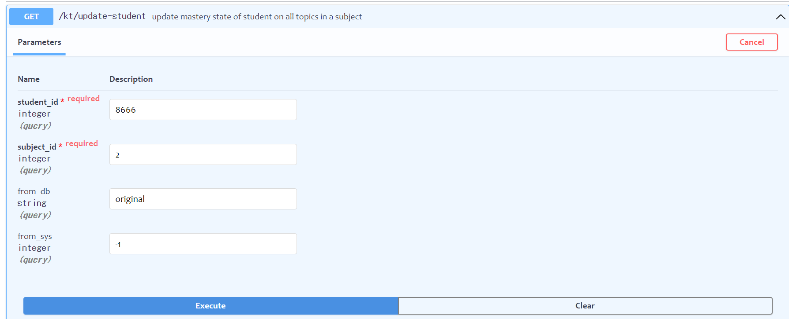

  - input params:

    |**Field** |  type | Description|
    |----------|-------|------------|
    | `from_db`| int | id of DB used to store user data. Default is "1" as for the smartjen.prod db (aws) |
    | `student_id`| int | Student ID in database corresponding user_id column in table sj_users.  |
    | `subject_id`| int | Valid subject ID in database. |
    |:new: `from_sys`| int | ID of System/Application user are using. Default is 0 (this param currently not use, but will be useful in future|


  - output json (success):
  
    ```json
        {
        "complete": true, 
        "msg": "Updated data of student 185 to RnD DB at 23-07-18 09:42:00",
        "execution time": 11.24968147277832 
        }
    ```


  - output json (error request):
    ```json
        {
        "complete": false,
        "execution time": <a number>
        }

        // example when u put student level and topic_id is conflict like topic:23, student_level=3 
        // --> no question in database has topic_id/topic_id2/3/4 = 23 and level_id/level_id2/3 = 3 
        {
          "complete": false,
          "msg": "This subtrand have no topic/questions at same student level"
        }
    ```
    

* :bangbang: **API 1.2**: Get student mastery regarding to specific topics. If student have enough data in "sj_performance_score" table, API will return detail information. If not, KT will return message related error. Besides, the API also return topic_ids which KT model cannot estimate due to litmited training data.
  - http method: GET
  - url request: `https://<this's private link>/kt/get-mastery`

    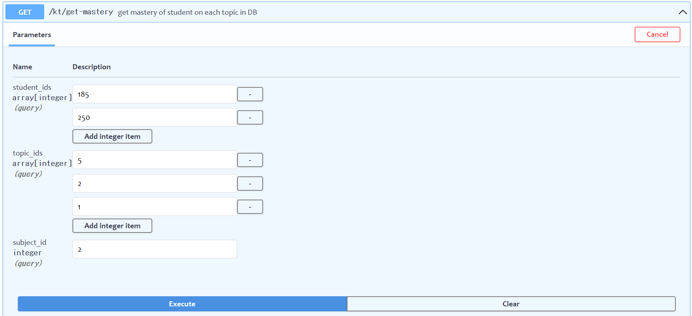

  - input params:

    |**Field** |  type | Description|
    |----------|-------|------------|
    | `from_db`| int | id of DB used to store user data. Default is "1" as for the smartjen.prod db (aws) |
    | `student_ids`| list[int] | List of Student ID in database corresponding user_id column in table sj_users.  |
    | `topic_ids`| list[int] | List of Topic ID in database corresponding user_id column in table sj_categories.  |
    | `subject_id`| int | Valid subject ID in database which those topics belong to|
    | `from_sys`| int | ID of System/Application user are using. Default is 0|

  - output json (success): assume that I'm getting for student_ids=185, 250 and topic_ids = 1,5,2

    ```json {r, class.output="scroll-10"}
    {
    "complete": true,
    "msg": {// msg dict: <student_id>:<data>
        "185": { 
            "mastery": { //mastery dict: <k>:<v> = <topic_id>:<value>
                "1": 0.07390880619974173, // the estimated mastery of student toward topic 1
                "2": 0.07183729705958077,
                "5": 0.07821531073092151
            }
        },
        "250": {
            "error": "This student doesn't have enough records in DB to estimate his proficiency" // because this student have records < 10. 
        }
    },

    "ignored_topic": [], // the additional term “ignored_topic” contains a list of new topics, which do not exist in training data of the KT model (in sj_performance_score table at the training time). In other words, we can only estimate a student's mastery on topics existing in sj_performance_score.
    }
    
    ```
  - output json (false):
    ```json
    {
        "complete": false,
        "msg"     : "error statement, which show that your request wasn't processed completely with specific reason",
        "execution time": 2.3 
    }
    ```

* :new: **API 1.3**: Get top k weakest topics of student under a substrand based on mastery_score(MS). We will prioritize topics having MS < B1 level> and Unknown (not practice).

  - http method: GET
  - url request: `https://<this's private link>/kt/find-weakest-topics`

    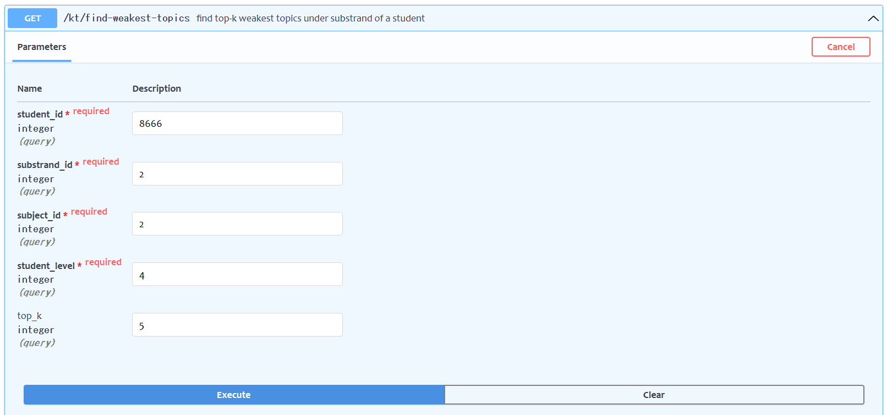

  - input params:

    |**Field** |  type | Description|
    |----------|-------|------------|
    | `from_db`| int | id of DB used to store user data. Default is "1" as for the smartjen.prod db (aws) |
    | `student_id`| int |  Student ID in database corresponding user_id column in table sj_users.  |
    | `substrand_id`| int | Substrand ID in database corresponding substrand_id column in table sj_categories.  |
    | `subject_id`| int | Valid subject ID in database which those topics belong to|
    | `student_level`| int | The current student level/grade. Which will be used to filter question by `level_id, level_id2, level_id3`  column in BD|
    | `from_sys`| int | ID of System/Application user are using. Default is 0|

  - output json (success): Return top-k weakest topics of student X under substrand Y
    ```json
      {"complete": true,
        "msg": {
          "weakest_topic_ids": [6, 7, 1, 410, 3, 2, 403],
          "ranks": [1, 2, 3, 4, 5, 6, 7 ], //1 is the highest rank = the weakest topic
          "mastery": [...],
          "categories": ["bad", "bad", "bad",...], //based on topic's masteries -->good(>.75) - norm (>.5) - bad
          "confidence": 90,
          "learning_paths": {
                "seq_path": [1, 2, 404,...,7], //sequence path
                "pal_path": {      //parallel path
                  "0": [1],                 // stage 1: should master these topics to unlock the higher stages
                  "1": [2, 404],            // stage 2: can learn topic 2, 404 in paralle
                  "2": [5],
                  "3": [411],
                  "4": [3],
                  "5": [6],
                  "6": [4],
                  "7": [7]
                },
                "reqs": {
                  "1": [],    // topic 1 requires no topic
                  "2": [1],   // topic 2 requires student learn topic 1 before
                  "3": [1,2,404,411], //topic 3 requires unlock topic 1,2,404, 411
                  ...
                }
              }
        },
        "execution time": 32.96420502662659
      }
    ```
  

  - error json:
    ```json
      {
        "complete": false,
        "msg": {},
        "execution time": 4.366819858551025
      }
    
    ```

3.  <ins>API in group **Student-side : Practice mode**</ins>


* :bangbang: **API 2.1**: Generate question list for student practice mode
  - http method: GET
  - url request: `https://<this's private link>/ss/genquests-topic`

    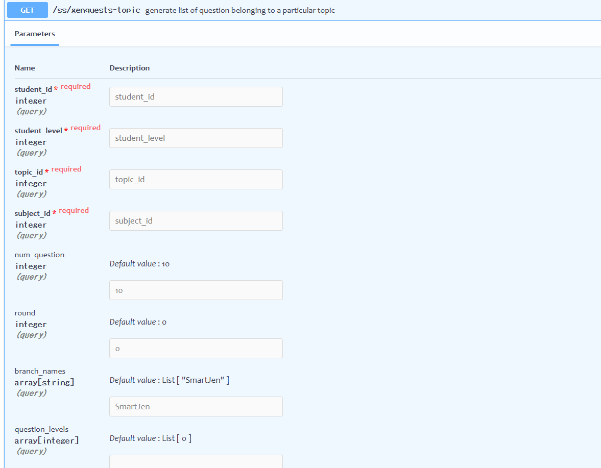

  - input params:

    |**Field** |  type | Description|
    |----------|-------|------------|
    | :bangbang: `from_db`| int | id of DB used to store user data. Default is "1" as for the smartjen.prod db (aws) |
    | `student_id`| int | Student ID in database corresponding user_id column in table sj_users.  |
    | `student_level`| int | The current student level/grade. Which will be used to filter question by `level_id, level_id2, level_id3`  column in BD  |
    | `topic_id`| int | ID of topic selected by student|
    | `num_question`| int | The number of question will be chosen from DB for the practice session.  |
    | `subject_id`| int | Valid subject ID in database. |
    | `branch_names`| list[str] | List of valid `branch names` (question bank) in database. |
    | `question_levels`| list[int] | List of `question_level` in database. |
    |`from_sys`| int | ID of System/Application user are using. Default is 0|

  - **Note**:  `round` is necessary to use cross-recommendation feature

  - output json (success): 

    ```json
    // for old student : estimate mastery value --> select suitable questions
    {
    "complete": true,
    "msg": {
        "185": { // student id
            "1": { // topic id
                "mastery-score": 0.07,  // current student proficiency.
                "ws": {                 // worksheet : dict with 3 level 
                    "hard": [],
                    "normal": [
                        "78603",     // question_id = reference_id in sj_questions
                        "12642"
                    ],
                    "easy": ["119815", "119354","54984","145893"
                    ],
                    "random":[] // questions in random difficulty
                }
            },
            "advice": {  
                "stt": "He should learn some prerequisite topics",
                "next_topic": [6,7] // cross-topic_id
            }
        }
    }
    }

    ```

    - `advice` response: include  "next_topic" containing list of topics relevant to the current topic. This list is suggested for student because the student mastery score either is high or too low.


    ```json
    // if new student --> diagnotic test with ratio easy-norm-hard = 0.4-0.4-0.2
    {
    "complete": true,
    "msg": {
        "2563": {
            "2": {
                "mastery-score": "unknown", // mastery value of new user
                "ws": {... }
            },
            "advice": {...}
        }
    },
    }
    
    ```

  - output json (false): if any error occurs in processing, API will response with error statement like this:
    ```json
    {
        "complete": false,
        "msg"     : "error statement, which show that your request wasn't processed completely with specific reason"
        "execution time": 2.3 // second
    }
    ```
    **The are some common errors**:
    - "This student doesn't have enough records in DB to estimate his proficiency"
    - "This subject is not supported by current KT-based recommender"
    - "Topic/substrand id is incorrect"
    - "Topic/substrand id is not supported by current KT-based recommender"

*  **API 2.2**: Generate question list for student practice mode
  - http method: GET
  - url request: `https://<this's private link>/ss/get-mastery`

    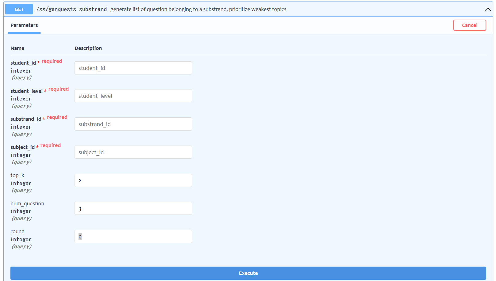

  - input params:

    |**Field** |  type | Description|
    |----------|-------|------------|
    | :bangbang: `from_db`| int | id of DB used to store user data. Default is "1" as for the smartjen.prod db (aws) |
    | `student_id`| int | Student ID in database corresponding user_id column in table sj_users.  |
    | `student_level`| int | The current student level/grade. Which will be used to filter question by `level_id, level_id2, level_id3`  column in BD  |
    | `substrand_id`| int | ID of substrand selected by student|
    | `top_k`| int | Recsys will choose top-k weakest topics of student and generate question focus on these topics.  |
    | `num_question`| int | The number of question for each topic.  |
    | `subject_id`| int | Valid subject ID in database. |
    | `branch_names`| list[str] | List of valid `branch names` (question bank) in database. |
    | `question_levels`| list[int] | List of `question_level` in database. |
    | `from_sys`| int | ID of System/Application user are using. Default is 0|
  - output json (success):
  
    ```json
    // for old student
    {
    "complete": true,
    "msg": {
        "185": { // student_id
            "412.0": { // 1st weakest topic_id
                "mastery-score": 0.188,
                "ws": {...}
            },
            "402.0": { // 1st weakest topic_id
                "mastery-score": 0.196,
                "ws": {...}
            }
        }
    },
    "execution time": 5.69
    }
    ```
    ```json
    {
    "complete": true,
    "msg": {
        "25": {
            "26": { // choose top k topics have most lowest scores.
                "mastery-score": "unknown", 
                "ws": {...}
            },
            "28": {
                "mastery-score": "unknown",
                "ws": {...}
            }
        }
    },
    }    
    ```

  - Failure cases: One of the commom error is no questions with level_id as same as . U will get:
    ```json
    {
      "complete": true,
      "msg": {
        "185": "This subtrand have no topic/question at same student level",
        "222": "This subtrand have no topic/question at same student level"
      },
      "execution time": 3.97523832321167
    }
      
    ```


4. <ins>API in group **Teacher-side : Worksheet generation**</ins>

* :bangbang: **API 3.1**: : Generate a Topic-specific intelligent question recommendation when Teacher generate AI WS for their student(s). Logic if student already have historical data: System to provide a 10 question recommendation with suitable difficulty based on student historical data using KT (similar to pratice mode by topic). Logic if student doesn’t have historical data : System to recommend 10 diagnostic question with various difficulty -> 4 easy question , 4 normal question, and 2 difficult question under selected topic

  - http method: POST
  - url request: `https://<this's private link>/ts/gen-ws-topic`

    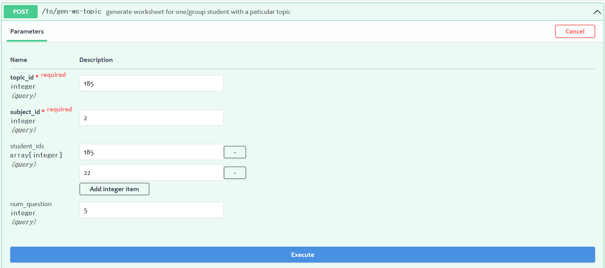

  - input params:

    |**Field** |  type | Description|
    |----------|-------|------------|
    | :bangbang: `from_db`| int | id of DB used to store user data. Default is "1" as for the smartjen.prod db (aws) |
    | `topic_id`| int | ID of topic selected by teacher|
    | `subject_id`| int | Valid subject ID in database. |
    | `student_ids`| list[int] | List of Student ID.  |
    | `student_level`| int | The current student level/grade. Which will be used to filter question by `level_id, level_id2, level_id3`  column in BD  |
    | `num_question`| int | The number of question will be chosen from DB for the practice session.  |
    | `branch_names`| list[str] | List of valid `branch names` (question bank) in database. |
    | `question_levels`| list[int] | List of `question_level` in database. |
    |:new: `from_sys`| int | ID of System/Application user are using. Default is 0|
  - output json (success):

    ```json
    {"complete": true,
    "msg": {
        "22": { // student_id 1
            "2": { // topic_id
                "mastery-score": "unknown", // mastery value of new student
                "ws": {...}
            }
        },
        "185": { // student_id 2
            "2": { // topic_id
                "mastery-score": 0.07,  // mastery value of old student
                "ws": {...}
            }
        }
    },
    "execution time": 8.319825410842896
    }
    
    ```


* **API 3.2**: Generate a Substrand-specific intelligent question recommendation when teacher generate worksheet for their student(s). If new student, we will choose question from top-k topics which most student don't master.
  - http method: GET
  - url request: `https://<this's private link>/ts/get-ws-substrand`

    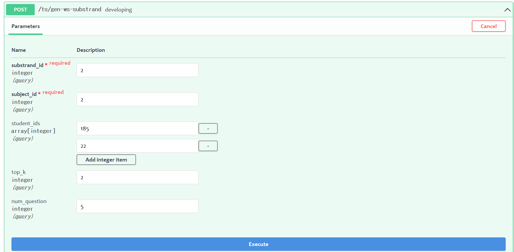

  - input params:

    |**Field** |  type | Description|
    |----------|-------|------------|
    | :bangbang: `from_db`| int | id of DB used to store user data. Default is "1" as for the smartjen.prod db (aws) |
    | `substrand_id`| int | ID of substrand selected by teacher|
    | `subject_id`| int | Valid subject ID in database. |
    | `student_ids`| list[int] | List of Student ID.  |
    | `student_level`| int | The current student level/grade. Which will be used to filter question by `level_id, level_id2, level_id3`  column in BD  |
    | `top_k`| int | Recsys will choose top-k weakest topics of student and generate question focus on these topics.  |
    | `num_question`| int | The number of question will be chosen from DB for the practice session.  |
    |  `branch_names`| list[str] | List of valid `branch names` (question bank) in database. |
    |  `question_levels`| list[int] | List of `question_level` in database. |


  - output json (success):

    ```json
    {
    "complete": true,
    "msg": {
        "22": { // new student id
            "8": { // topic_id--> 1st topic most students get trouble to solve
                "mastery-score": "unknown",
                "ws": {...} // diagnotic test
            },
            "9": { // topic_id--> 2nd topic most students have the most difficulty to solve
                "mastery-score": "unknown",
                "ws": {...}
            }
        },
        "185": {
            "11": { 
                "mastery-score": 0.18,
                "ws": {...} // questions based on mastery-score
            },
            "15": {
                "mastery-score": 0.17,
                "ws": {...}
            }
        }
    },
    "execution time": 7.49
    }
    ```

  - failure: One of the commom error is no questions with level_id as same as . U will get:
  
    ```json
    {
      "complete": true,
      "msg": {
        "185": "This subtrand have no topic/question at same student level",
        "222": "This subtrand have no topic/question at same student level"
      },
      "execution time": 3.97523832321167
    }
      
    ```

* **API 3.2**: Generate a Substrand-specific intelligent question recommendation when teacher generate worksheet for their student(s). If new student, we will choose question from top-k topics which most student don't master.
  - http method: GET
  - url request: `https://<this's private link>/ts/get-ws-substrand`

    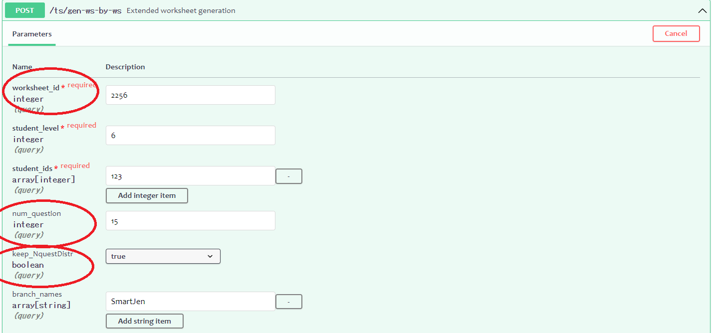

  - input params (new compare to 3.2, 3.1):

    |**Field** |  type | Description|
    |----------|-------|------------|
    | :bangbang: `from_db`| int | id of DB used to store user data. Default is "1" as for the smartjen.prod db (aws) |
    | `worksheet_id`| int | ID of substrand selected by teacher|
    | `num_question`| int | The **total number of question** of the new WS .  |
    | `student_ids`| list[int] | List of Student ID.  |
    | `student_level`| int | The current student level/grade. Which will be used to filter question by `level_id, level_id2, level_id3`  column in BD  |
    | `keep_NquestDistr`| bool | Allow to keep the distribution of the number of questions between topics or choose more questions on the weakest topic of the student. Default is True (for now)  |


  - output json (success/failure): is as same as API 3.2, 3.1 


5. :new: <ins>API in group **Knowledge graph Interaction**</ins>

* **API 4.1**: Find next topics for a student after he finish practicing on a topic. This recommendation is based on the performance score of student on the input topic.

  - http method: GET
  - url request: `https://<this's private link>/kg/find_next_topic_4student`

    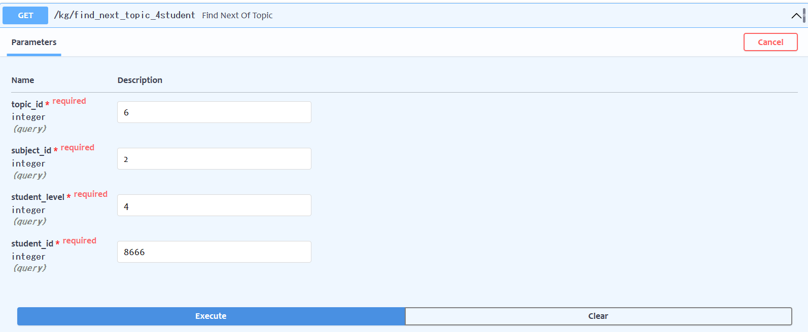

  - input params:

    |**Field** |  type | Description|
    |----------|-------|------------|
    | :bangbang: `from_db`| int | id of DB used to store user data. Default is "1" as for the smartjen.prod db (aws) |
    | `subject_id`| int | Valid subject ID in database. |
    | `topic_id`| int | ID of topic selected by teacher|
    | `student_level`| int | grade level of topic [1-13]|
    | `student_id`| int |  id  of student|   
    | `from_sys`| int | ID of System/Application user are using. Default is 0|

  - output:
    ```json
    {
      "complete": True,
      "topics": [7, 6, 17, 16, 33 ], //Topic_ids
      "ranks": [ 1, 2,  3,  4,  5 ] //rank of topics (1 is the highest)
    }
    ```
  - **Note**:
    - `rank` shows how close the two topics are. The smaller value, the closer the relation is.
    - `student_id`: We will prioritize topics the student hasn't mastered (assign to high ranks) .

  - error:
    ```json
    {
      "complete": False,
      "topics": [],
      "ranks": []
    }
    ```
    If error occurs, let random to suggest :>

* **API 4.2**: Get requirements of topics based on Knowledge graph
  - http method: GET
  - url request: `https://<this's private link>/kg/get-topic-reqs`

    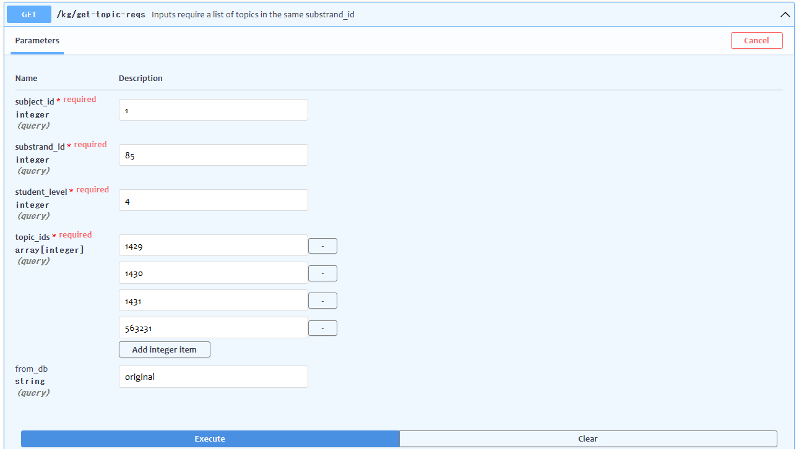

  - input params:

    |**Field** |  type | Description|
    |----------|-------|------------|
    | :bangbang: `from_db`| int | id of DB used to store user data. Default is "1" as for the smartjen.prod db (aws) |
    | `subject_id`| int | Valid subject ID in database. For now, it just supports PE (id 1) and PM (id2)|
    | `student_level`| int | grade level of topic [1-13]|
    | `substrand_id` | int | the substrand contains topics|
    |  `topic_ids`   | list(int) | list of topic_id |

  - output: .
    ```json
      {
        "complete": true,
        "msg": {
          "1429": [1427,1428],   //list of topic requirements of topic 1429. All topic in the list is in the same substrand of 1429
          "1430": [1427,1428,1429
          ],
          "1431": [],
          "563231": []
        }
      }
    ```

* :new: **API 4.3**: Ordor substrand based on KG
  - http method: GET
  - url request: `https://<this's private link>/kg/order-substrands`

    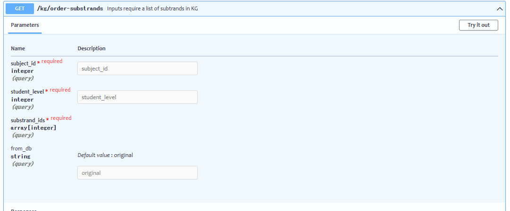

  - input params:

    |**Field** |  type | Description|
    |----------|-------|------------|
    | :bangbang: `from_db`| int | id of DB used to store user data. Default is "1" as for the smartjen.prod db (aws) |
    | `subject_id`| int | Valid subject ID in database. For now, it just supports PE (id 1) and PM (id2)|
    | `student_level`| int | grade level of topic [1-13]|
    | `substrand_ids` | lit(int) | a list of substrand_id you want to sort out|

  - output: .
    ```json
    {
      "complete": true,
      "msg": {
        "learning_paths": {
          "0": [81, 82],  // this means that substrand 81 and 82 can be learnt simultaneously
          "1": [83]
        },
        "reqs": {
          "81": [],
          "82": [],
          "83": [81]  // substrand 83 requires student to learn 81 firt.
        }
      }
    }
    ```


    * :new: **API 4.4**: get list of topics and substrands having enough questions 
  - http method: GET
  - url request: `https://<this's private link>/kg/filter-topic`

    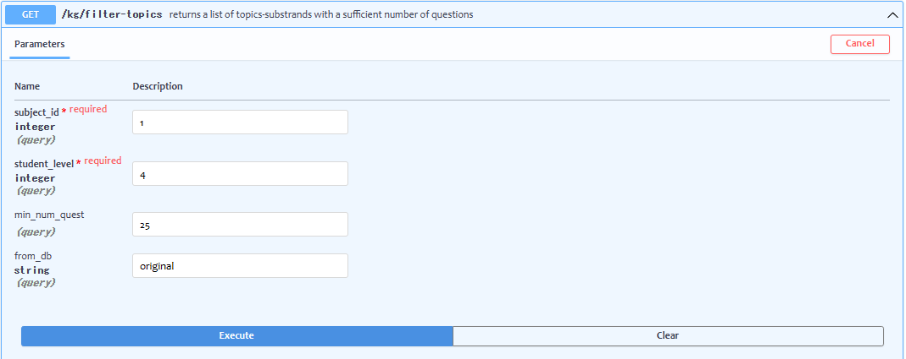

  - input params:

    |**Field** |  type | Description|
    |----------|-------|------------|
    | :bangbang: `from_db`| int | id of DB used to store user data. Default is "1" as for the smartjen.prod db (aws) |
    | `subject_id`| int | Valid subject ID in database. For now, it just supports PE (id 1) and PM (id2)|
    | `student_level`| int | grade level of topic [1-13]|
    | `mim_num_quest` | int | if a topic has the number of questions >₫ `min_num_quest`, it will  be considered as available |

  - output: .
    ```json
      {
        "complete": true,
        "msg": {
          "58": [ 313, 414],  //substrand 58 has 2 availble topics with sufficient number of question (313, 414)
          "72": [325 ],
          "74": [372],
          "75": [380],
          ...
        }
      }
    ```


6. <ins>API in group **Special Worksheet generation**</ins>

* **API 5.1**: Create worksheet under topic for diagnotic test or final test. It also allow modify the distribution of difficulty level.

  - http method: GET
  - url request: `https://<this's private link>/wsg/dtest/bytopic`

    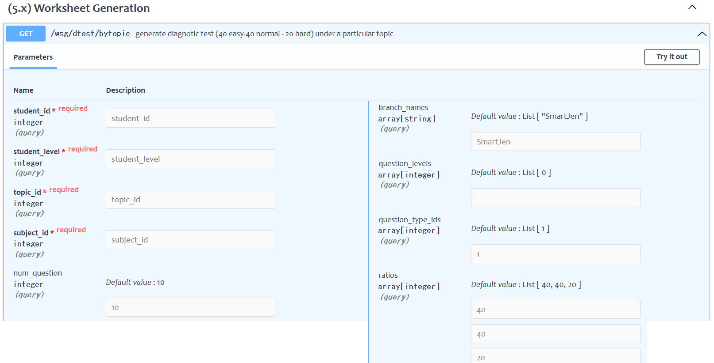

  - input params:

    |**Field** |  type | Description|
    |----------|-------|------------|
    | :bangbang: `from_db`| int | id of DB used to store user data. Default is "1" as for the smartjen.prod db (aws) |
    | `student_id`| int |  id  of student|   
    | `subject_id`| int | Valid subject ID in database. |
    | `topic_id`| int | ID of topic |
    | `student_level`| int | grade level of topic [1-13]|
    | `num_question`| int | the question number of WS|
    | .....         | ... | ........................ |
    | `ratios`      | list(int)| include 3 number present percetage of each difficulty type of question. For example [40, 40, 20] (default) is that the generated ws will have 40% easy question, 40% norm question and 20% hard question respectively.


  - output: Similar to API for practice mode but not based on Mastery score.
    ```json
      {
        "complete": true,
        "msg": {
          "hard": [3143, 3127, 3128, 3142,  3129 ],
          "normal": [ 4556, 3138, 4576, ... ],
          "easy": [...  ],
          "random": [... ]
        },
        "execution time": 2.085296154022217
      }
    ```
  - error:
    ```json
    {"complete": False, ...   }
    ```

* **API 5.2**: Create worksheet under substrand for diagnotic test or final test. It also allow modify the distribution of difficulty level.

  - http method: GET
  - url request: `https://<this's private link>/wsg/dtest/bytopic`

    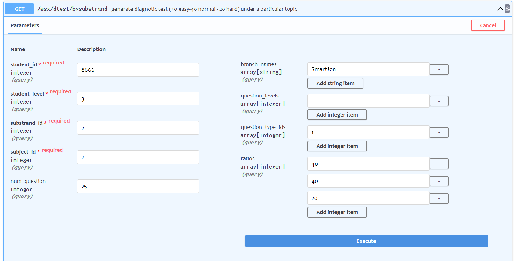

  - input params:

    |**Field** |  type | Description|
    |----------|-------|------------|
    | :bangbang: `from_db`| int | id of DB used to store user data. Default is "1" as for the smartjen.prod db (aws) |
    | `student_id`| int |  id  of student|   
    | `subject_id`| int | Valid subject ID in database. |
    |:bangbang: `substrand_id`| int | ID of substrand_id|
    | `student_level`| int | grade level of topic [1-13]|
    | `num_question`| int | the question number of WS|
    | .....         | ... | ........................ |
    | `ratios`      | list(int)| include 3 number present percetage of each difficulty type of question. For example [40, 40, 20] (default) is that the generated ws will have 40% easy question, 40% norm question and 20% hard question respectively.


  - output: Similar to API 5.1.
    ```json
      {
        "complete": true,
        "msg": {
          "hard": [3143, 3127, 3128, 3142,  3129 ],
          "normal": [ 4556, 3138, 4576, ... ],
          "easy": [...  ],
          "random": [... ]
        },
        "execution time": 2.085296154022217
      }

