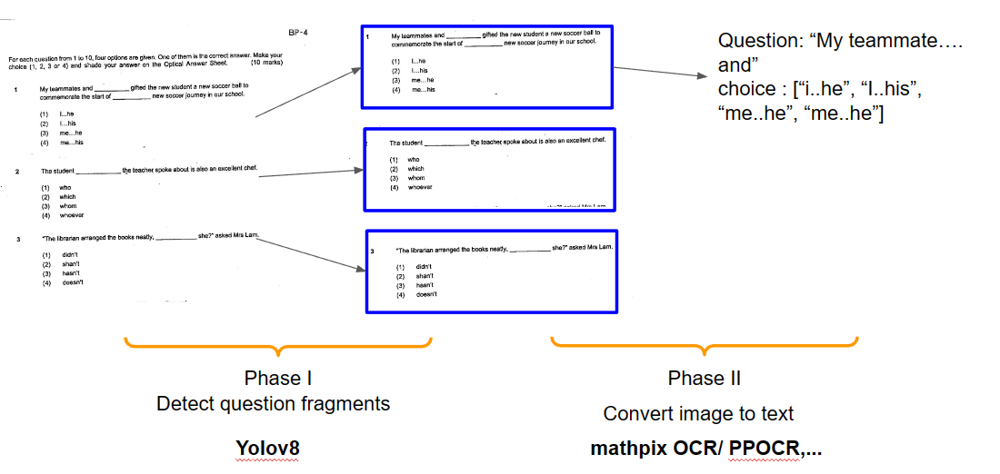

# Detect Question forms from pdf
 



# Getting 
- Evironment :

```python
pip install -r requirements.txt
```

## Training
- [yolov8](notebook/README.md)


## Deploy
- Analysize execution time with (line-profiler)[https://github.com/pyutils/line_profiler]
  - kernprof -lv .\deploy\test\test.py

- Create Restful API by fastAPI
  - run server
    ```python
    python deloy/app.py
    ```
  - test docs: "localhost:9000/docs"
- Build Docker image and test:
  - `docker build . -t test`
  - `docker run -p 9000:9000 test:latest`
  - - test docs: "localhost:9000/docs"

- Deploy on AWS Lambda [tutorial](https://youtu.be/VYk3lwZbHBU)
  - login to aws
  - build docker : ```docker build -t test_layout_analysis -f Dockerfile.aws.lambda ``` 
  - put on aws est  